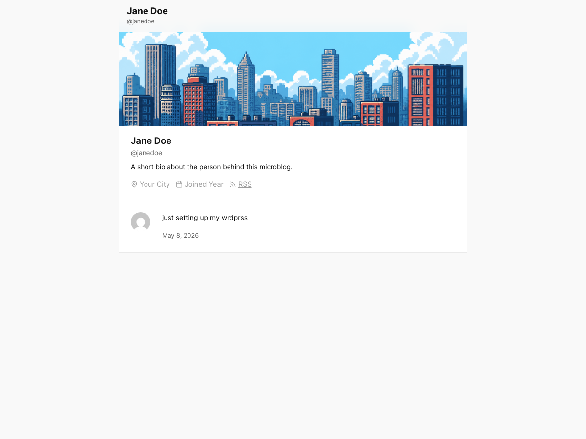

# Microposting

A minimal block theme for short-form, single-author feeds.

Microposting turns a WordPress site into a single-author, Twitter-style feed: short posts stacked in cards, a profile header, no sidebars, no clutter. It's a full block theme — every part is editable from the Site Editor.



## Requirements

- WordPress 6.7 or later
- PHP 7.2 or later

## Installation

### From a release zip

1. Download the latest [release zip](https://github.com/Poliuk/microposting/releases) (or zip this repository).
2. In WordPress, go to **Appearance → Themes → Add New → Upload Theme**.
3. Choose the zip, click **Install Now**, then **Activate**.

### Via git clone

```bash
cd wp-content/themes
git clone https://github.com/Poliuk/microposting.git
```

Then activate **Microposting** from **Appearance → Themes**.

### Via WP-CLI

```bash
wp theme install https://github.com/Poliuk/microposting/archive/refs/heads/main.zip --activate
```

## Setup

After activating:

1. Set up your [Gravatar](https://gravatar.com) using the email address on your WordPress user account — Microposting uses it as the profile avatar in the header and post cards.
2. Edit the profile bio in **Appearance → Editor → Patterns → Header** (or by editing `parts/header.html`).
3. Start posting. Short posts render as cards in the feed; longer posts work as full single-post pages.

## Customising

- **Colors, fonts, spacing:** **Appearance → Editor → Styles**.
- **Templates** (`index`, `single`, `archive`, `page`, `404`): **Appearance → Editor → Templates**, or edit the HTML files in `templates/`.
- **Header / footer / topbar:** **Appearance → Editor → Patterns → Template Parts**, or edit `parts/*.html`.
- **PHP behaviour** (avatar block override, pagination button wrapping, "Read More" link, etc.): see `functions.php`.

## License

GPL-3.0-or-later. See [LICENSE](LICENSE).
