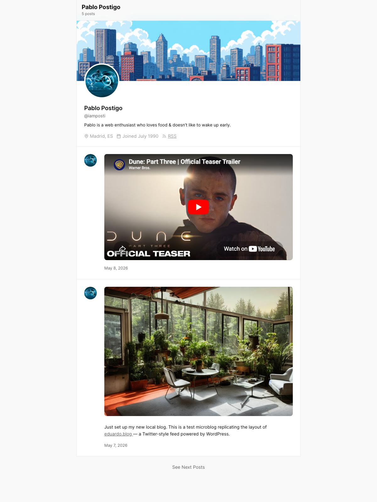
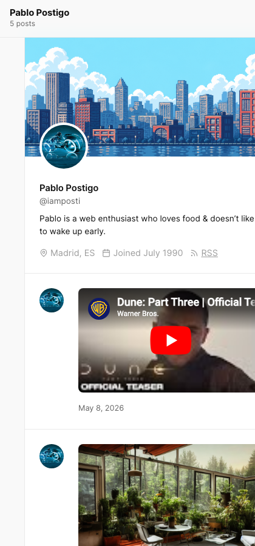

# Microblog

A minimal personal microblog block theme for WordPress.

Microblog turns a WordPress site into a single-author, Twitter-style feed: short posts stacked in cards, a profile header, no sidebars, no clutter. It's a full block theme — every part is editable from the Site Editor.



## Features

- **Block theme.** Built entirely with `theme.json`, block templates, and template parts. No PHP markup to maintain.
- **Centered single-column feed** at 714px, optimised for short-form posts.
- **Profile header** with site avatar (uses your Site Icon), display name, handle, and bio.
- **Post cards** with author avatar, post content, and date — styled like a microblog timeline.
- **Avatar = Site Icon.** The `core/avatar` and `core/site-logo` blocks are filtered to use the WordPress Site Icon, so your favicon, app icon, and on-site avatar are always in sync.
- **Read more →** link replaces the default `(more…)` teaser, styled inline with the rest of your post links.
- **Pagination buttons** that match the "See More Posts" button on single posts (consistent button styling across the theme).
- **Variable web fonts** — Inter (body) and Cardo (headings) loaded from [Bunny Fonts](https://fonts.bunny.net/) (GDPR-friendly, no Google Fonts).
- **Mobile-first top bar** that stays in document flow on mobile and scrolls with the page.
- **Light, semantic palette** with Base / Contrast / Accent slots that you can override from Site Editor → Styles.

## Screenshots

| Desktop | Mobile |
| --- | --- |
|  |  |

## Requirements

- WordPress 6.7 or later
- PHP 7.2 or later

## Installation

### From a release zip

1. Download the latest [release zip](https://github.com/Poliuk/microblog/releases) (or zip this repository).
2. In WordPress, go to **Appearance → Themes → Add New → Upload Theme**.
3. Choose the zip, click **Install Now**, then **Activate**.

### Via git clone

```bash
cd wp-content/themes
git clone https://github.com/Poliuk/microblog.git
```

Then activate **Microblog** from **Appearance → Themes**.

### Via WP-CLI

```bash
wp theme install https://github.com/Poliuk/microblog/archive/refs/heads/main.zip --activate
```

## Setup

After activating:

1. Go to **Settings → General** and set a **Site Icon** — Microblog uses it as the profile avatar everywhere on the site.
2. Edit the profile bio in **Appearance → Editor → Patterns → Header** (or by editing `parts/header.html`).
3. Start posting. Short posts render as cards in the feed; longer posts work as full single-post pages.

## Customising

- **Colors, fonts, spacing:** **Appearance → Editor → Styles**.
- **Templates** (`index`, `single`, `archive`, `page`, `404`): **Appearance → Editor → Templates**, or edit the HTML files in `templates/`.
- **Header / footer / topbar:** **Appearance → Editor → Patterns → Template Parts**, or edit `parts/*.html`.
- **PHP behaviour** (avatar block override, pagination button wrapping, "Read More" link, etc.): see `functions.php`.

## License

GPL-3.0-or-later. See [LICENSE](LICENSE).
